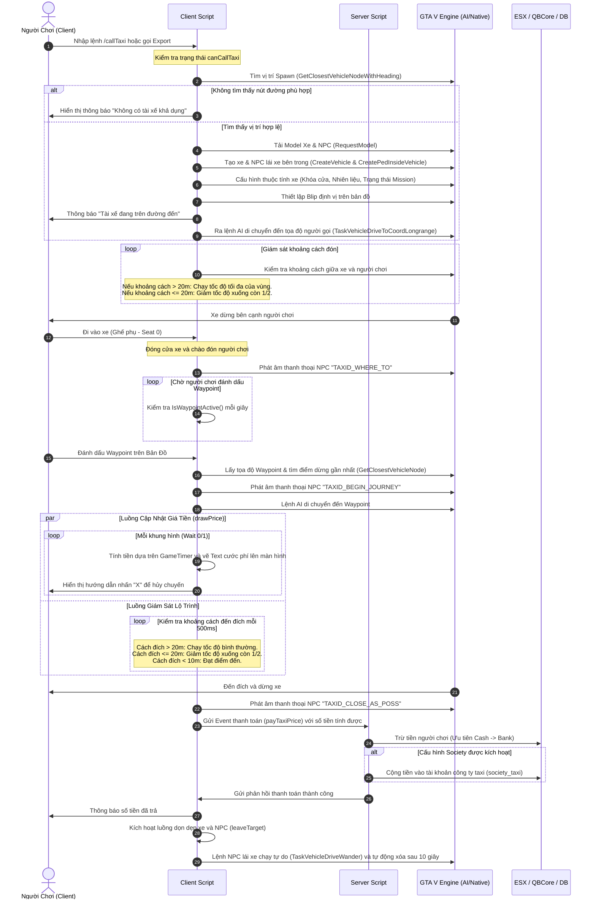

# Báo Cáo Phân Tích Cơ Chế Hoạt Động Của Resource `msk_aitaxi` (FiveM)

Tài liệu này cung cấp một cái nhìn toàn diện, chi tiết và chuyên nghiệp về cách hoạt động của resource **`msk_aitaxi`** - một hệ thống taxi tự động sử dụng trí tuệ nhân tạo (AI) của NPC dành cho các máy chủ GTA V (FiveM). Resource hỗ trợ các framework phổ biến như **ESX**, **QBCore** và chế độ **Standalone** (hoạt động độc lập).

---

## 1. Tổng Quan Về Resource

Hệ thống `msk_aitaxi` cho phép người chơi gọi một chiếc taxi do NPC lái đến vị trí của họ thông qua lệnh chat hoặc export. NPC taxi sẽ đón người chơi, nhận điểm đến từ Waypoint (dấu định vị trên bản đồ) của người chơi, chở họ đến đó an toàn và tự động trừ tiền (tiền mặt hoặc ngân hàng) dựa trên thời gian/khoảng cách di chuyển thực tế.

Hệ thống có cấu trúc tinh gọn với các file chính:
*   `fxmanifest.lua`: Khai báo siêu dữ liệu (metadata) và tài nguyên tải vào server/client.
*   `config.lua`: Cấu hình toàn bộ hệ thống từ giá cả, tốc độ, phong cách lái xe đến các dòng xe và NPC.
*   `translation.lua`: Đa ngôn ngữ (mặc định hỗ trợ Tiếng Đức `de` và Tiếng Anh `en`).
*   `server.lua`: Xử lý logic phía Server (kiểm tra framework, trừ tiền người chơi, cộng tiền vào tài khoản công ty taxi, kiểm tra phiên bản cập nhật).
*   `client.lua`: Xử lý logic phía Client (tương tác phím bấm, tạo xe, tạo NPC, điều khiển AI lái xe, tính toán tiền cước động, vẽ giao diện).

---

## 2. Phân Tích Kiến Trúc Và Cơ Chế Kỹ Thuật Chi Tiết

Dưới đây là sơ đồ Mermaid thể hiện toàn bộ vòng đời hoạt động của một chuyến taxi từ lúc gọi xe đến lúc hoàn thành thanh toán và dọn dẹp thực thể.

### Sơ Đồ Luồng Hoạt Động (Flowchart)



---

## 3. Phân Tích Chi Tiết Từng File Mã Nguồn

### 3.1. fxmanifest.lua
File cấu hình siêu dữ liệu của resource dành cho hệ thống FiveM:
*   Sử dụng phiên bản FX `'cerulean'`.
*   Chỉ định môi trường chạy trò chơi là `'gta5'`.
*   Bật tính năng Lua 5.4 (`lua54 'yes'`), cho phép sử dụng các cú pháp và thư viện nâng cao hơn của Lua.
*   **`shared_scripts`**: Tải `config.lua` và `translation.lua` lên cả Client lẫn Server. Điều này rất quan trọng vì các định nghĩa về cấu hình và đa ngôn ngữ cần được truy cập đồng bộ ở cả hai phía.
*   **`client_scripts`**: Nạp file logic phía client `client.lua`.
*   **`server_scripts`**: Nạp file logic phía server `server.lua`.

---

### 3.2. config.lua
Chứa toàn bộ các tham số cấu hình của hệ thống:
*   `Config.Locale = 'de'`: Thiết lập ngôn ngữ mặc định (Tiếng Đức).
*   `Config.VersionChecker = true`: Cho phép tự động kiểm tra phiên bản mới từ kho lưu trữ GitHub của tác giả khi khởi chạy Server.
*   `Config.Notification`: Hàm hiển thị thông báo chung. Hàm này tự nhận biết môi trường thông qua native `IsDuplicityVersion()` để quyết định gọi thông báo phía Server hay Client qua export của thư viện `msk_core`.
*   `Config.Framework = 'ESX'`: Chọn Framework sử dụng. Hỗ trợ `'ESX'`, `'QBCore'`, hoặc `'Standalone'`.
*   `Config.Society`:
    *   `enable = false`: Nếu được bật (`true`), số tiền khách hàng trả sẽ được chuyển vào tài khoản chung của công ty taxi (Society Account).
    *   `account = 'society_taxi'`: Tên tài khoản của công ty taxi trong cơ sở dữ liệu hoặc hệ thống ngân hàng ảo.
*   `Config.Command`: Định nghĩa lệnh chat gọi taxi. Mặc định là `/callTaxi`.
*   `Config.AbortTaxiDrive`: Định nghĩa lệnh và phím tắt hủy chuyến. Mặc định lệnh là `/abortTaxi`, phím nóng là phím `X` trên bàn phím.
*   `Config.SpawnRadius = 200.0`: Bán kính tối đa (mét) xung quanh người chơi để sinh ra (spawn) xe taxi. Khuyến cáo không nên đặt quá 200m vì giới hạn render của GTA V có thể gây lỗi không tìm thấy đường đi của thực thể.
*   `Config.DrivingStyle = 786731`: Giá trị bitmask quy định phong cách lái xe của NPC AI. Phong cách `786731` bao gồm: tuân thủ đèn tín hiệu giao thông, tránh xe cộ khác vượt ẩu, nhường đường cho người đi bộ, giữ khoảng cách an toàn, chạy đúng làn đường và dừng lại khi có vật cản.
*   `Config.SpeedType = 3.6`: Hệ số đổi đơn vị tốc độ. Mặc định trong GTA V, tốc độ được tính bằng mét trên giây (m/s). Chia cho `3.6` giúp chuyển đổi cấu hình km/h thành m/s.
*   `Config.SpeedZones`: Định nghĩa giới hạn tốc độ tối đa cho taxi trên các loại đường khác nhau (nhận diện qua loại Node đường bộ):
    *   `[2] = 100`: Đường đô thị chính.
    *   `[10] = 60`: Đường nhỏ, tốc độ chậm.
    *   `[64] = 60`: Đường đất, ngoài quốc lộ.
    *   `[66] = 150`: Đường cao tốc.
    *   `[82] = 150`: Đường hầm cao tốc.
*   `Config.Price`: Cấu trúc biểu phí cước taxi:
    *   `base = 20`: Giá mở cửa (phí cố định khi xe di chuyển đến đón khách).
    *   `tick = 0.15`: Số tiền cộng thêm sau mỗi nhịp thời gian (tick).
    *   `tickTime = 50`: Thời gian của mỗi tick tính bằng mili-giây (ms).
        > [!WARNING]
        > Với cấu hình mặc định `tick = 0.15` và `tickTime = 50`, cứ mỗi 50ms (0.05 giây) số tiền sẽ tăng thêm $0.15. Nghĩa là mỗi giây di chuyển sẽ tốn $3.00, và mỗi phút di chuyển sẽ tốn $180.00. Đây là mức phí khá cao và các chủ máy chủ cần lưu ý điều chỉnh giá trị `tickTime` cao hơn (ví dụ: `1000` cho mỗi giây hoặc `60000` cho mỗi phút) để cân bằng nền kinh tế trong game.
    *   `color` & `position`: Tùy chỉnh màu sắc (mặc định trắng) và tọa độ hiển thị cước phí trên HUD màn hình (dưới dạng tỷ lệ tọa độ X, Y).
*   `Config.Taxi`: Danh sách xe và tài xế ngẫu nhiên:
    *   `vehicles`: Mẫu xe (mặc định là xe `taxi`).
    *   `pedmodels`: Định nghĩa thông tin tài xế NPC bao gồm tên hiển thị, model của ped và mã giọng nói (voice) của GTA V để phát ra âm thanh khi trò chuyện.

---

### 3.3. translation.lua
Cung cấp các văn bản dịch thuật cho giao diện người dùng và thông báo hệ thống:
*   Hỗ trợ sẵn hai ngôn ngữ: `de` (Tiếng Đức) và `en` (Tiếng Anh).
*   Chứa các khóa thông tin quan trọng như:
    *   `input`: Hướng dẫn nhấn nút hủy chuyến.
    *   `price`: Định dạng hiển thị tiền cước hiện tại.
    *   `paid`: Thông báo số tiền đã khấu trừ.
    *   `not_available`: Thông báo lỗi khi không tìm thấy vị trí spawn taxi hợp lệ.
    *   `on_the_way`: Thông báo xe đang trên đường đến.
    *   `welcome`: Lời chào của tài xế khi người chơi lên xe, giới thiệu tên tài xế.
    *   `end`: Thông báo đã tới điểm hẹn yêu cầu.
    *   `abort`: Thông báo khi chuyến đi bị hủy giữa chừng.

---

### 3.4. server.lua
Chịu trách nhiệm thực thi các tác vụ xử lý dữ liệu nhạy cảm ở phía máy chủ để chống gian lận (exploit):

#### 1. Khởi tạo đối tượng Framework:
Đoạn mã tự động lấy Shared Object tương ứng với framework được chọn:
```lua
if Config.Framework == 'ESX' then
    ESX = exports["es_extended"]:getSharedObject()
elseif Config.Framework == 'QBCore' then
    QBCore = exports['qb-core']:GetCoreObject()
end
```

#### 2. Các hàm bổ trợ:
*   `round(num, decimal)`: Làm tròn số thực `num` tới số chữ số thập phân chỉ định bằng hàm định dạng chuỗi `string.format`.
*   `comma(int, tag)`: Định dạng chuỗi tiền tệ bằng cách thêm dấu phân cách phần nghìn (mặc định là dấu chấm `.`). Ví dụ chuyển đổi `10000` thành `10.000`.

#### 3. Xử lý thanh toán cước phí `msk_aitaxi:payTaxiPrice`:
Sự kiện mạng (Net Event) này được kích hoạt từ client khi hành trình kết thúc hoặc bị hủy:
*   Nhận tham số cước phí `payAmount` từ Client và tiến hành làm tròn số bằng `round()`.
*   **Trừ tiền người chơi**:
    *   **ESX**: Truy vấn thông tin người chơi thông qua `xPlayer`. Kiểm tra số dư tài khoản tiền mặt `'money'`. Nếu tiền mặt nhỏ hơn số tiền cần thanh toán, hệ thống sẽ tự động chuyển sang trừ vào tài khoản ngân hàng `'bank'`. Sau đó gọi hàm `xPlayer.removeAccountMoney()`.
    *   **QBCore**: Truy vấn thông tin người chơi thông qua `Player`. Kiểm tra số dư ví tiền mặt `'cash'`. Nếu ví không đủ, hệ thống tự động đổi sang phương thức trừ tiền ngân hàng `'bank'`. Sau đó gọi hàm `Player.Functions.RemoveMoney()`.
    *   **Standalone**: Để trống để các quản trị viên tự thêm logic trừ tiền tùy chỉnh (ví dụ: truy vấn trực tiếp từ cơ sở dữ liệu SQL).
*   Gửi thông báo thành công cho người chơi hiển thị số tiền đã trả qua hàm `Config.Notification`.
*   **Cộng tiền vào tài khoản công ty taxi (Society)**:
    Nếu cấu hình `Config.Society.enable` là `true`:
    *   **ESX**: Sử dụng sự kiện `esx_addonaccount:getSharedAccount` để tìm tài khoản công ty taxi và thêm tiền vào bằng hàm `account.addMoney()`.
    *   **QBCore**: Gọi export `qb-banking` để cộng tiền vào tài khoản công ty qua hàm `AddMoney()`.

#### 4. Kiểm tra cập nhật mã nguồn:
Hàm `GithubUpdater()` gửi một yêu cầu HTTP GET bằng native `PerformHttpRequest` đến đường dẫn chứa tệp lưu trữ phiên bản của tác giả trên GitHub (`https://raw.githubusercontent.com/MSK-Scripts/msk_aitaxi/main/VERSION`).
*   Nếu không kết nối được hoặc không có dữ liệu trả về, in ra cảnh báo phiên bản hiện tại và yêu cầu cập nhật.
*   Nếu kết nối thành công, so sánh phiên bản được cấu hình trong `fxmanifest.lua` với phiên bản mới nhất trên GitHub để đưa ra thông báo tương thích hay lỗi thời tương ứng trong bảng điều khiển của Server (Console Log).

---

### 3.5. client.lua
Đây là tệp tin cốt lõi điều khiển toàn bộ hành vi vật lý, chuyển động của AI và tương tác giao diện người dùng. Dưới đây là phân tích chi tiết từng giai đoạn xử lý:

#### 1. Đăng ký Lệnh và Phím Tắt
*   Đăng ký lệnh gọi taxi: Nếu được bật, nó sẽ liên kết lệnh `/callTaxi` với việc gọi hàm `callTaxi()`.
*   Đăng ký lệnh hủy chuyến: Liên kết lệnh `/abortTaxi` với hàm `abortTaxiDrive(true)`. Đồng thời, nó dùng hàm `RegisterKeyMapping` của FiveM để ánh xạ lệnh này vào phím nóng trên bàn phím (mặc định là phím `X`). Điều này giúp người chơi có thể nhấn phím `X` để dừng xe ngay lập tức thay vì phải gõ lệnh thủ công.

#### 2. Tìm kiếm Vị trí Spawn Xe (`getStartingLocation`)
Hệ thống sử dụng thuật toán tìm kiếm nút giao thông đường bộ gần nhất của GTA V:
```lua
getStartingLocation = function(coords)
    local found, spawnPos, spawnHeading = GetClosestVehicleNodeWithHeading(
        coords.x + math.random(-Config.SpawnRadius, Config.SpawnRadius), 
        coords.y + math.random(-Config.SpawnRadius, Config.SpawnRadius), 
        coords.z, 0, 3.0, 0
    )
    return found, spawnPos, spawnHeading
end
```
*   Hàm cộng thêm một khoảng dịch chuyển ngẫu nhiên trong phạm vi của `Config.SpawnRadius` (ví dụ: từ -200m đến +200m) vào tọa độ hiện tại của người chơi.
*   Native `GetClosestVehicleNodeWithHeading` sẽ tìm kiếm điểm nút đường bộ (Road Node) gần nhất với tọa độ ngẫu nhiên đó để đảm bảo xe taxi được sinh ra trên mặt đường nhựa có thật thay vì sinh ra trên mái nhà hoặc rơi xuống dưới bản đồ. Hàm này trả về trạng thái tìm kiếm thành công (`found`), tọa độ chính xác của nút đường (`spawnPos`) và hướng quay của xe tương thích với chiều giao thông (`spawnHeading`).

#### 3. Tạo Thực Thể Xe Và NPC (`spawnVehicle`)
Khi bắt đầu hành trình:
*   Gọi hàm tìm vị trí spawn bên trên. Nếu không tìm thấy, hàm trả về `false` và kết thúc hành trình sớm.
*   Tạo xe taxi bằng native `CreateVehicle` tại tọa độ nút đường đã tìm thấy.
*   Thiết lập các thuộc tính vật lý bảo mật cho xe taxi:
    *   `SetVehicleOnGroundProperly`: Đặt bánh xe tiếp xúc chính xác với mặt đất.
    *   `SetVehicleEngineOn`: Động cơ xe nổ máy sẵn.
    *   `SetVehicleUndriveable`: Ngăn không cho bất kỳ người chơi nào cướp xe để lái đi (vô hiệu hóa quyền kiểm soát lái xe).
    *   `SetVehicleIndividualDoorsLocked(task.vehicle, 0, 2)`: Khóa cửa số 0 (cửa tài xế) với mức khóa 2 để người chơi không thể mở cửa kéo tài xế ra ngoài.
    *   `SetVehicleDoorCanBreak(task.vehicle, 0, false)`: Đảm bảo cửa tài xế không thể bị phá hủy vật lý.
    *   `SetVehicleFuelLevel` & `DecorSetFloat`: Thiết lập xăng đầy 100% để tránh việc taxi hết xăng giữa đường.
    *   `SetEntityAsMissionEntity`: Đánh dấu xe là một thực thể quan trọng của nhiệm vụ để game không tự động dọn dẹp (despawn) xe khi người chơi đi quá xa.
*   Tạo thực thể tài xế NPC bên trong xe bằng native `CreatePedInsideVehicle`.
    *   `SetAmbientVoiceName`: Thiết lập bộ giọng nói cho tài xế phù hợp với cấu hình.
    *   `SetBlockingOfNonTemporaryEvents(task.npc, true)`: Bắt buộc tài xế NPC bỏ qua các sự kiện môi trường xung quanh (như tiếng súng nổ, các vụ va chạm giao thông hoặc tiếng còi cảnh sát) để tập trung duy nhất vào nhiệm vụ lái xe đưa đón người chơi mà không hoảng loạn bỏ chạy.
    *   `SetDriverAbility(task.npc, 1.0)`: Đặt kỹ năng lái xe của NPC lên mức tối đa (lái lụa nhất có thể, tránh đâm đụng).
*   Gắn một blip taxi (icon màu vàng trên bản đồ) vào xe taxi bằng `AddBlipForEntity` để người chơi theo dõi lộ trình di chuyển của xe trên minimap.

#### 4. Đón Khách và Kiểm soát Lộ trình Đón (`startDriveToPlayer`)
*   Hàm tìm điểm đỗ xe gần người chơi nhất bằng `getStoppingLocation(playerCoords)` (sử dụng native `GetClosestVehicleNode`).
*   Lấy loại mặt đường tại điểm dừng thông qua `getVehNodeType(toCoords)` để lấy giới hạn tốc độ phù hợp từ cấu hình `Config.SpeedZones`.
*   Sử dụng native điều khiển lái xe tầm xa của GTA V:
    ```lua
    TaskVehicleDriveToCoordLongrange(task.npc, task.vehicle, toCoords.x, toCoords.y, toCoords.z, speed, Config.DrivingStyle, 5.0)
    ```
    *   `speed` là tốc độ đã quy đổi từ cấu hình.
    *   `Config.DrivingStyle` định hình cách lái xe.
    *   `5.0` là khoảng cách dừng chấp nhận được (mét).
*   `SetPedKeepTask(task.npc, true)`: Giữ nhiệm vụ lái xe này vĩnh viễn, không bị các nhiệm vụ nhỏ khác của trò chơi chen ngang.
*   **Vòng lặp kiểm tra khoảng cách đón**: Chạy mỗi 500ms để kiểm tra vị trí xe so với người chơi. Nếu khoảng cách dưới 20 mét, tốc độ xe sẽ tự động giảm đi một nửa để dừng lại nhẹ nhàng bên cạnh người chơi thay vì phanh gấp đột ngột.

#### 5. Người Chơi Vào Xe và Đặt Điểm Đến
Hệ thống lắng nghe các sự kiện ra/vào xe của người chơi. Nếu máy chủ không cài đặt resource `msk_enginetoggle`, một luồng xử lý riêng ở dòng 289-327 sẽ chạy ngầm mỗi 200ms để theo dõi hành động của người chơi bằng native `GetVehiclePedIsTryingToEnter`:
*   **Khi đang vào xe (`enteringVehicle`)**:
    *   Kiểm tra xem xe người chơi đang định vào có trùng khớp với xe taxi vừa gọi hay không.
    *   Kiểm tra xem ghế định ngồi có phải là ghế phụ trước hoặc ghế sau (seat >= 0) hay không. Nếu người chơi cố vào ghế lái xe (seat = -1), hệ thống sẽ cưỡng chế đưa người chơi vào ghế phụ (seat = 0) bằng hàm `SetPedIntoVehicle`.
*   **Khi đã vào xe (`enteredVehicle`)**:
    *   Xóa Blip định vị xe taxi trên bản đồ (vì người chơi đã ở trong xe).
    *   Tài xế NPC phát ra giọng nói thoại `"TAXID_WHERE_TO"` hỏi xem hành khách muốn đi đâu.
    *   Hiện thông báo chào mừng của tài xế kèm theo tên riêng của họ.
    *   Chuyển sang hàm `checkWaypoint()` để chờ người chơi thiết lập điểm đến.
*   **Chờ thiết lập điểm đến (`checkWaypoint`)**:
    *   Chạy vòng lặp kiểm tra trạng thái Waypoint bằng `IsWaypointActive()` sau mỗi 1 giây.
    *   Khi người chơi nhấp đúp để tạo một điểm đến màu tím trên bản đồ GPS, hàm sẽ lấy tọa độ của điểm đó bằng `GetBlipCoords(GetFirstBlipInfoId(8))` và kích hoạt hành trình lái xe `startDriveToCoords()`.

#### 6. Hành Trình Đến Điểm Đích (`startDriveToCoords`)
*   Ghi lại thời gian bắt đầu di chuyển: `task.startTime = GetGameTimer()`.
*   NPC phát giọng nói thoại bắt đầu hành trình: `"TAXID_BEGIN_JOURNEY"`.
*   Tài xế nhận lệnh lái xe tới tọa độ điểm dừng gần Waypoint nhất bằng native lái xe tầm xa.
*   Kích hoạt luồng vẽ thông tin tiền cước (`drawPrice()`).
*   **Vòng lặp giám sát hành trình di chuyển**: Chạy mỗi 500ms.
    *   Khi khoảng cách tới điểm đích lớn hơn 20.0m, hệ thống liên tục cập nhật tốc độ tương thích với phân vùng đường mà taxi đang chạy qua.
    *   Khi khoảng cách dưới 20.0m, giảm tốc độ xuống một nửa để chuẩn bị đỗ xe.
    *   Khi khoảng cách dưới 10.0m (đã tới đích):
        *   Tài xế phát âm thanh thông báo đã đến nơi: `"TAXID_CLOSE_AS_POSS"`.
        *   Gửi yêu cầu thanh toán cước phí lên Server qua `msk_aitaxi:payTaxiPrice` với công thức tính giá cước động.
        *   Đặt cờ trạng thái `taxi.finished = true` để dừng vòng lặp cập nhật.
        *   Sau khi kết thúc, tiếp tục gọi `checkWaypoint()` để hỗ trợ trường hợp hành khách muốn đi tiếp tới một địa điểm khác mà không cần xuống xe gọi lại từ đầu.

#### 7. Tính Toán Cước Phí Thực Tế
Cước phí được tính toán trực tiếp theo thời gian thực dựa trên thời gian di chuyển bằng mili-giây:
$$\text{Cước Phí} = \text{Config.Price.base} + \left( \text{Config.Price.tick} \times \frac{\text{GetGameTimer()} - \text{task.startTime}}{\text{Config.Price.tickTime}} \right)$$

*Ví dụ thực tế với các tham số mặc định:*
*   Giá cơ sở (`base`): \$20.
*   Phí mỗi tick (`tick`): \$0.15.
*   Thời gian mỗi tick (`tickTime`): 50 mili-giây.
*   Nếu chuyến đi kéo dài đúng **30 giây** ($30.000$ mili-giây):
    *   Tổng số tick tích lũy: $\frac{30.000}{50} = 600$ ticks.
    *   Tổng tiền cước phát sinh thêm: $600 \times 0.15 = \$90.00$.
    *   Tổng chi phí người chơi phải trả: $\$20 (\text{gốc}) + \$90 = \$110.00$.
*   Số tiền này sẽ được làm tròn lên số nguyên gần nhất bằng hàm `math.ceil` trước khi gửi lên Server để thực hiện trừ tài khoản.

#### 8. Hủy Chuyến Giữa Chừng (`abortTaxiDrive`)
Nếu hành khách nhấn phím nóng (phím `X`) hoặc gõ lệnh `/abortTaxi`:
*   Đánh dấu trạng thái chuyến đi là đã hủy `taxi.canceled = true`.
*   Nếu taxi chưa đón khách (chưa vào chế độ di chuyển đến đích): Hiện thông báo hủy và thực hiện dọn dẹp xe ngay.
*   Nếu taxi đang di chuyển chở khách:
    *   Nếu hủy bằng phím bấm trực tiếp, hệ thống ra lệnh cho tài xế đạp phanh dừng xe gấp:
        ```lua
        TaskVehicleTempAction(task.npc, task.vehicle, 27, 1000)
        ```
        *(Mã hành động 27 tương ứng với lệnh phanh khẩn cấp dừng xe của GTA V trong vòng 1 giây)*.
    *   Tiến hành tính toán số tiền cước tích lũy tính tới thời điểm hủy chuyến bằng công thức tính giá cước động và gửi sự kiện lên Server để yêu cầu người chơi thanh toán phần lộ trình đã đi qua.
    *   Kích hoạt dọn dẹp thực thể.

#### 9. Cơ Chế Giải Phóng Bộ Nhớ và Thực Thể (`leaveTarget`)
Đây là phần cực kỳ quan trọng để giữ hiệu năng máy chủ ổn định và tránh lỗi rác bộ nhớ (entity leaking):
*   Giải phóng Blip định vị trên bản đồ bằng `RemoveBlip(blip)`.
*   Reset toàn bộ bảng dữ liệu trạng thái `taxi` và `task` về rỗng `{}`.
*   Đối với thực thể xe và NPC tài xế:
    *   Ra lệnh cho NPC lái xe di chuyển lang thang tự do trên đường để khuất tầm nhìn của người chơi bằng native `TaskVehicleDriveWander` với tốc độ 17.0 m/s.
    *   Đóng toàn bộ cửa xe lại và khóa chặt cửa để người chơi không thể lên lại xe lần nữa.
    *   Chờ một khoảng thời gian 10 giây (`Wait(10000)`) để xe di chuyển ra xa vị trí người chơi.
    *   Hạ mức độ quản lý thực thể bằng native `SetPedAsNoLongerNeeded` và `SetEntityAsNoLongerNeeded` nhằm báo cáo cho hệ thống rác của GTA V biết thực thể này không còn liên kết với kịch bản trò chơi nữa.
    *   Cuối cùng, gọi trực tiếp `DeleteEntity(npc)` và `DeleteEntity(vehicle)` để giải phóng hoàn toàn tài nguyên khỏi bộ nhớ RAM của Server/Client.

---

## 4. Tổng Kết Ưu Điểm Và Đề Xuất Tối Ưu Hóa Kịch Bản

### 4.1. Điểm Mạnh Của Hệ Thống:
1.  **Sử dụng thuần Native tầm xa của GTA V**: Việc áp dụng `TaskVehicleDriveToCoordLongrange` giúp NPC tự động tìm đường đi tối ưu nhất dựa trên hệ thống mạng lưới đường xá có sẵn của GTA V mà không cần viết thuật toán tìm đường (Pathfinding) thủ công, giúp tiết kiệm tối đa hiệu năng xử lý của Client.
2.  **Khả năng tự phục hồi trạng thái**: Trong quá trình xe di chuyển đến đón khách hoặc đưa khách đến đích, nếu xe bị kẹt giữa đường (do tai nạn hoặc vật cản lớn), vòng lặp giám sát 500ms liên tục cập nhật lại lệnh lái xe nhằm giải phóng NPC khỏi trạng thái đứng im.
3.  **Tích hợp thanh toán an toàn**: Logic tính tiền động được xử lý thông tin cẩn thận trên Client nhưng việc thực thi khấu trừ tiền thực tế lại được đẩy lên Server xử lý thông qua các sự kiện mạng bảo mật, tự động chuyển đổi linh hoạt giữa tiền mặt và tài khoản ngân hàng dựa trên số dư thực tế.
4.  **Cơ chế dọn dẹp tốt**: Hàm dọn dẹp thực thể tránh hoàn toàn tình trạng để lại xe taxi hoặc tài xế NPC đứng im vô hạn trên đường sau khi người chơi thoát game hoặc hoàn thành chuyến đi.

### 4.2. Các Đề Xuất Tối Ưu Hóa (Dành cho Lập Trình Viên):
1.  **Tối ưu hóa vòng lặp vẽ cước phí (`drawPrice`)**:
    Vòng lặp vẽ cước phí sử dụng `Wait(1)` hoặc `Wait(0)` chạy liên tục để vẽ HUD tiền cước lên màn hình. Mặc dù đây là điều bắt buộc khi dùng native vẽ text 2D trong GTA V, nhưng phép tính toán số tiền cước được gọi lặp lại hàng trăm lần mỗi giây trong hàm `DrawGenericText` và `HelpNotification`.
    *Giải pháp tối ưu*: Nên tính toán giá trị này trong một luồng riêng chạy mỗi 500ms hoặc 1000ms và lưu vào một biến toàn cục `currentFare`, luồng vẽ chỉ cần hiển thị giá trị biến `currentFare` đó để tránh việc thực hiện các phép tính nhân chia số thực liên tục ở mỗi khung hình hệ thống.
2.  **Xử lý trường hợp Người chơi chết hoặc thoát game giữa chừng**:
    Nếu người chơi bị chết hoặc đột ngột mất kết nối khi đang ngồi trên taxi, xe taxi và NPC tài xế có thể bị kẹt lại trong thế giới game mà không được kích hoạt luồng dọn dẹp `leaveTarget()`.
    *Giải pháp tối ưu*: Nên bổ sung thêm các sự kiện lắng nghe trạng thái của người chơi như `esx:onPlayerDeath` hoặc kiểm tra trạng thái sống sót `IsPlayerDead(PlayerPedId())` trong luồng giám sát hành trình để tự động kích hoạt `abortTaxiDrive()` dọn dẹp thực thể khi hành khách không còn khả năng tiếp tục hành trình.
